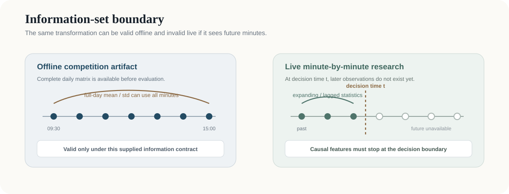

# AlphaSeeker — TradeMaster 2026

Financial time-series forecasting artifact from the **HKUST(GZ) TradeMaster Cup 2026**, where our team placed **5th**. This repository preserves the modeling work behind the competition submission and makes the evaluation assumptions explicit enough to distinguish an offline forecasting artifact from a deployable trading system.

<p align="center">
  
</p>

## Scope

The task uses minute-indexed tabular features and three forecasting targets with different horizons. The repository currently contains three modeling paths:

| Path | File | Role |
| --- | --- | --- |
| XGBoost | `models/submissionpipelinexgb.py` | tree baseline with daily normalization, interaction features, chronological train/validation split, and weighted MAE evaluation |
| GRU | `models/final_gru.py` | 30-step sequence model with contextual daily statistics and weighted multi-horizon loss |
| Blend | `models/blend.py` | submission-level combination of model outputs |

The code is retained close to the competition implementation rather than rewritten to imply a cleaner experiment than was actually run.

## Evaluation contract

The competition objective combines three target horizons using a weighted MAE:

\[
L = 0.1\,\mathrm{MAE}_{short} + 0.3\,\mathrm{MAE}_{medium} + 0.6\,\mathrm{MAE}_{long}.
\]

Both main pipelines split training and validation data by `date_id`, so the validation period is temporally later than the training period. This is preferable to a random row split for non-stationary financial data.

That chronological split does **not** by itself make every feature causal. The information-set boundary is discussed below.

## Information-set and leakage audit

The current competition code performs **full-day normalization** within each `date_id`.

- `submissionpipelinexgb.py` computes each feature's daily mean and standard deviation before constructing daily z-scores.
- `final_gru.py` concatenates train and test frames for feature construction and also computes full-day means/standard deviations within each day.

For an offline competition where the complete daily feature matrix is supplied, this can be a valid feature transformation under the competition's data-access contract. For a live minute-by-minute forecasting interpretation, the same transformation would use observations from later minutes of the day and therefore violate the causal information set.

A research or deployment version should replace full-day statistics with one of the following, depending on the intended decision time:

1. lagged statistics estimated from previous days only;
2. expanding intraday statistics using observations available up to time `t`;
3. rolling statistics with an explicitly lagged window;
4. cross-sectional normalization at a timestamp when the full cross-section is genuinely observable.

Any future result reported from this repository should state which information set is used. Competition scores and causal/out-of-time research results should not be mixed.

## Reproducibility boundary

The original competition dataset is not redistributed here. The scripts expect:

```text
dataset/
├── train_v2.csv
└── test_v2.csv
```

with at least:

- `id`
- `date_id`
- `minute_id`
- `feature_1` ... `feature_30`
- `target_short`, `target_medium`, `target_long` in the training set

The current scripts are research snapshots rather than a packaged library. They contain model training, validation, inference, and submission generation in one file so the original competition path remains auditable.

## What this repository demonstrates

The useful part of this project is the modeling and evaluation process under noisy financial time series:

- chronological validation instead of random row splitting;
- comparison of tree-based and recurrent models;
- multi-horizon loss weighting;
- feature normalization and interaction design;
- explicit recognition that offline leaderboard features and deployable causal features have different information constraints.

The next research-quality revision should add a leakage-safe feature pipeline and walk-forward evaluation before making any claim about out-of-sample trading usefulness.

## Status

**Archived competition artifact / research baseline.** The repository is being cleaned up for reproducibility and methodological clarity. It should not be interpreted as investment advice or as evidence of a production trading strategy.